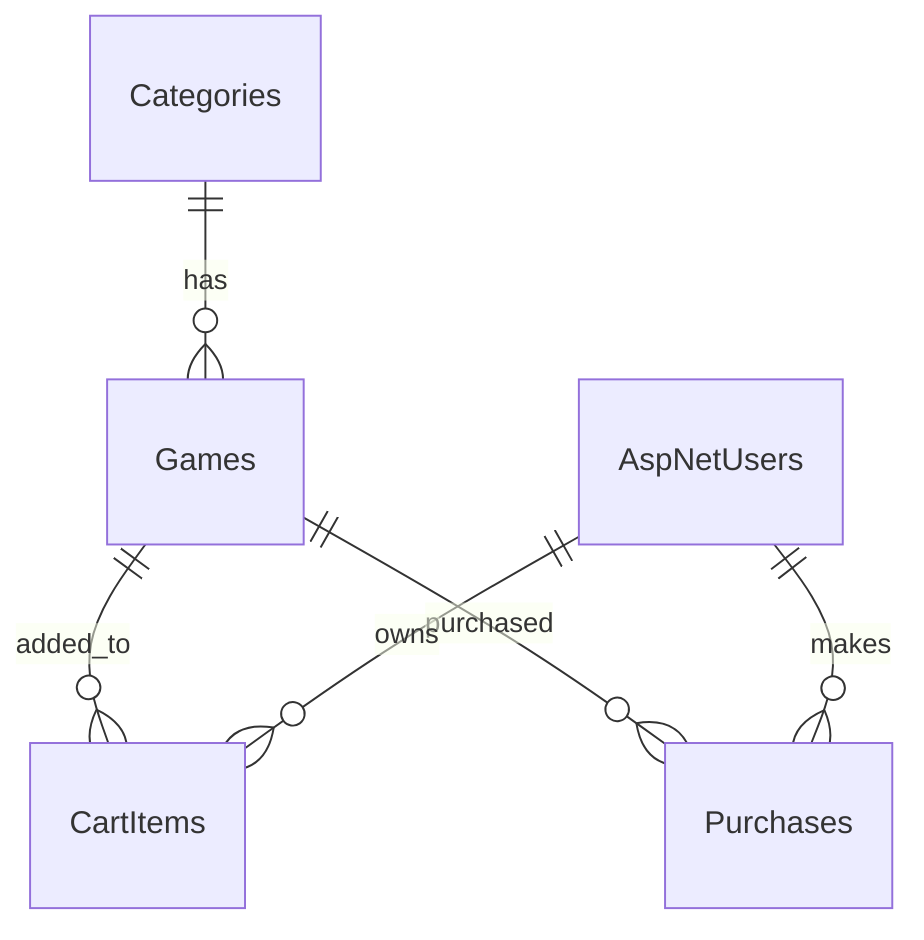
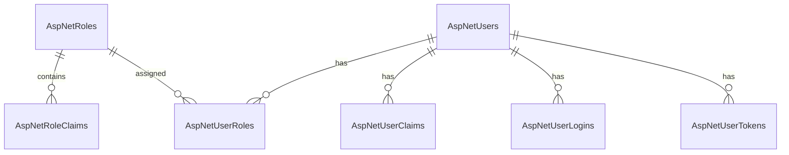
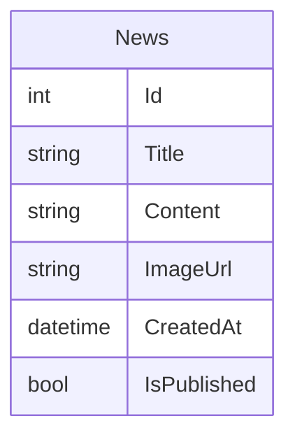

## 🎮 Game Portal 

## 📦 Версия 1.0 (15.02.2025)

### ✅ Реализовано
- CRUD для игр 
- Регистрация и авторизация пользователей (ASP.NET Identity)
- Покупка игры
- Проверка повторной покупки
- Карточки игр с hover-эффектом
- Онлайн-игры (CatchLetter, MathGame)

### ⚙ Использовано
- ASP.NET Core Razor Pages
- Entity Framework Core
- MS SQL Server
- Identity

---

### ER Diagramma V1.4.1
На этой диаграмме представлена ​​структура базы данных GamePortal v1.4.1,
включая бизнес-сущности и схему ASP.NET Core Identity.


Бизнес - логика


Identity



Новости




### Game Purchase Flow
Диаграмма того, как происходит процесс покупки игры пользователем

```mermaid
flowchart TD

A[User opens game page]
B{Game already purchased?}
C[Show "Purchased"]
D[Add game to cart]
E[Open Cart page]
F{Game available?}
G[Show "Unavailable"]
H[Checkout]
I[Create Purchase record]
J[Remove item from Cart]
K[Show success message]

A --> B

B -- Yes --> C
B -- No --> D

D --> E
E --> F

F -- No --> G
F -- Yes --> H

H --> I

I --> J

J --> K

```

Более подробно о версии 1.0

 1) Добавлены сущности для работы:
      - Category - категории игр
      - Game - игры которые можно купить
      - News - Новости, которые будут пояляться на странице новостей
      - Puchases - Запись в БД о покупке игры

 2) Реализована работа с MS SQL Server.
    Но будет предусмотрена работа с PostgreSQL и SQLite.

 3) Добавлены карточки игр в тестовом режиме

 4) Реализована технология Razor Page с поддержкой Entity Framework (CRUD) для самих игр
      - Есть возможность добавить игру. Сделано через Razor Page "AddGame".
      - Есть возможность "Удалить", "Редактировать" и "Посмотреть подробнее выбранную игру"
      - В дальнейшем функции будут переделаны и большая часть функций будет доступна только администратору.

 5) Добавлен Microsoft.AspNetCore.Identity.EntityFramework.
      - Есть возможность регистрации пользователя (тестовый режим)
      - Покупка доступна только зарегестировнным пользователям

 6) Реализован простой механизм покупки:a
      - при нажатии на кнопку "Купить", добавляется запись в БД,
      - Есть защита от повторной покупки. Одну игру можно купить только один раз.

 7) Есть одна онлайн игра для демонстрации.

 8) Имеется Backup базы данных для MS SQL SERVER просто для демонстрации :
    --- DataBaze_Backup\MS_SQL ---

    ## Backup базы данных

    Файл резервной копии создан через T-SQL:
    BACKUP DATABASE GamePortal_v1
    TO DISK = 'GamePortal_v1.bak'
    WITH FORMAT, INIT, NAME = 'GamePortal_v1 Full Backup';

## Версия 1.1

### Добавлено:
- Роль "Admin" 
  (Логин - admin@example.com
   Пароль - Admin123!) 
- Автоматическое создание администратора при запуске
- Разграничение доступа через [Authorize(Roles = "Admin")]
- Логирование регистрации пользователя (Serilog)
- Настроены уровни логирования Microsoft/System (Warning)

### ⚙ Использовано
- Serilog ASP.NET Core Razor Pages
- Serilog Sinks File

## Изменения в версии 1.1.1
- Улучшена система логирования(Понижен уровень логирования EF Core до Error)
- Реализован визуальный индикатор купленной игры (кнопка "Куплено")

## Версия 1.2

### Добавлено:
- Система корзины (CartItem)
- Теперь игры сначала добавляются в корзину
- Покупка осуществляется только после нажатия кнопки "Оплатить"
- Добавлено состояние для игр (активные и нет)
- Переделано UI для добавления и редактирования игры, а так же для покупки
- Сделано UI корзины
- Сделано 3 полностью оформленных игры

## Версия 1.3

### Добавлено:
- Добавлена поддержка REST API (Minimal API)
- Создан класс: GamesREST.cs
- Реализован полный CRUD для ресурса Game
- Используются DTO:CreateGameDto и UpdateGameDto
- Добавлена серверная валидация через ValidationProblemDetails
- Добавлен Swagger
- Добавлен интерактивный интерфейс SwaggerUI для тестирования REST API
- Динамический новости
- Добавлено 9 демонстрационных новостных записей для тестирования
- На странице "Новости" отображается 6 случайных новостей

Проверка работы SWAGGER:
https://localhost:7093/swagger

### Изменения в весии 1.3
- Переработано логирование, стандартный ILogger заменён на Serilog
- Добавлена настройка фильтрации логов по типу пользователя через:
LogContext.PushProperty("LogType", "Role")
- Реализовано раздельное логирование:UserLog и AdminLog
- Улучшена работа с Identity
- Локализованы сообщения об ошибках регистрации

## Версия 1.4

### Добавлено:
- Добавлена поддержка нескольких баз данных
- По умолчанию используется MS SQL Server. Для него созданы миграции
- Возможно переключиться на SQLite или PostgreSQL (для их создания используется механизм EnsureCreate)
- Переключение осуществляется через выбор провайдера в файлеappsettings.json

### Изменения в весии 1.4
- Поле "Категория игры" (CategoryId) теперь обязательно

## Изменения в версии 1.4.1
### Добавлено
- Заполнены страницы «Распродажа» и «Топ 10 игр» на основе флагов IsOnSale и IsTopGame
- Добавлен HTML5-аудиоплеер (фоновая музыка)

### Интерфейс
- Плеер сохраняет позицию воспроизведения при переходе между страницами

## Изменения в версии 1.4.2
- Упрощен ввод пароля: пароль может не содержать цифр, заглавных/строчных букв, спецсимволов
