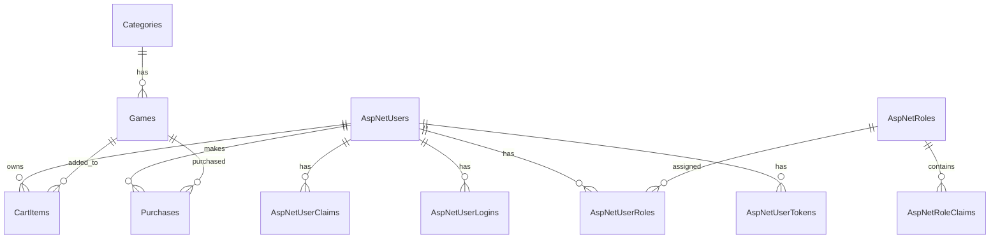

### ER Diagramma V1.4.1
На этой диаграмме представлена ​​структура базы данных GamePortal v1.4.1,
включая бизнес-сущности и схему ASP.NET Core Identity.

```mermaid
erDiagram

    Categories ||--o{ Games : has
    Games ||--o{ CartItems : added_to
    Games ||--o{ Purchases : purchased
    AspNetUsers ||--o{ CartItems : owns
    AspNetUsers ||--o{ Purchases : makes

    AspNetRoles ||--o{ AspNetRoleClaims : contains
    AspNetRoles ||--o{ AspNetUserRoles : assigned
    AspNetUsers ||--o{ AspNetUserRoles : has
    AspNetUsers ||--o{ AspNetUserClaims : has
    AspNetUsers ||--o{ AspNetUserLogins : has
    AspNetUsers ||--o{ AspNetUserTokens : has
```
